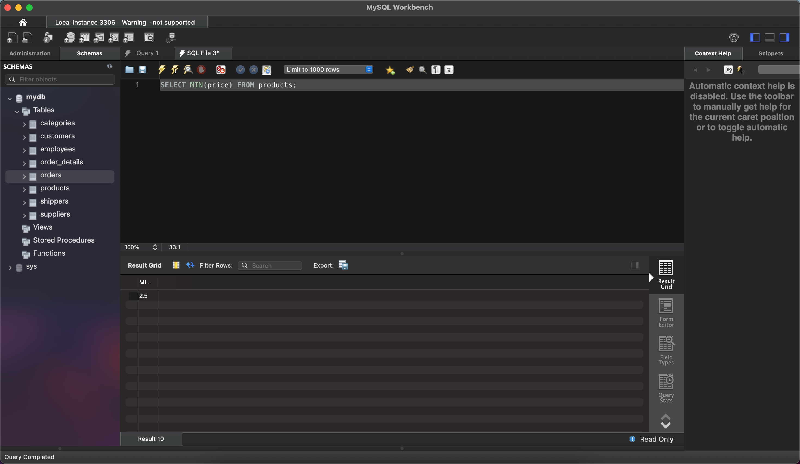
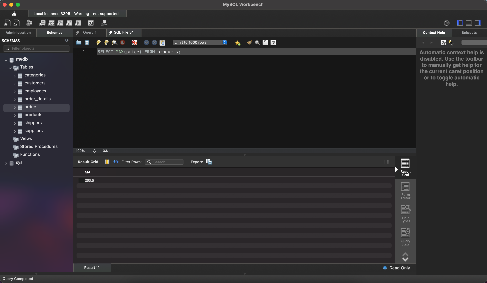

## Task 1

### Command

```sql
SELECT * FROM products;
```


### Command

```sql
SELECT name, phone FROM shippers;
```


## Task 2

```sql
SELECT AVG(price) FROM products;
```


```sql
SELECT MIN(price) FROM products;
```



```sql
SELECT MAX(price) FROM products;
```



## Task 3

```sql
SELECT DISTINCT category_id, price FROM products;
```


```sql
SELECT DISTINCT category_id, price 
FROM products 
ORDER BY price
LIMIT 10;
```


## Task 4

```sql
SELECT COUNT(id) 
FROM products 
WHERE price > 20 AND price < 100;
```


## Task 5

```sql
SELECT supplier_id, COUNT(id), AVG(price)
FROM products 
GROUP BY supplier_id
```

